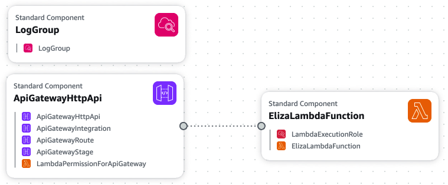

# Eliza-GPT Lambda

A compact, deployable AWS Lambda project that exposes the classic Eliza chatbot via an OpenAI-style chat completion API. The Lambda handler is implemented in `lambda/app.py` and packages the Eliza implementation so the function can run standalone in AWS Lambda.

## Acknowledgments

This project uses [Eliza-GPT](https://github.com/miguelgrinberg/Eliza-GPT) by Miguel Grinberg as a git submodule. Eliza-GPT is a Python implementation of the classic ELIZA chatbot that provides an OpenAI-compatible API interface. All credit for the core Eliza logic and implementation goes to Miguel Grinberg and the Eliza-GPT project.

### About ELIZA

ELIZA, created by MIT computer scientist Joseph Weizenbaum in 1966, is often considered the world's first chatbot. Weizenbaum designed ELIZA to simulate a Rogerian psychotherapist by cleverly turning a client's statements into questions (*People don't like me.* → *Why do you think people don't like you?*). This technique created the illusion of understanding without the program actually comprehending what users were saying.

Despite its simplicity—or perhaps because of it—ELIZA was surprisingly effective at convincing users that it understood them. As Weizenbaum described in his [original 1966 paper](https://dl.acm.org/doi/10.1145/365153.365168), "*ELIZA—a computer program for the study of natural language communication between man and machine*," the program demonstrated that computers didn't need genuine understanding to engage in apparently meaningful conversation.

The enthusiastic response to ELIZA troubled Weizenbaum. He later argued that human intelligence and computer logic are fundamentally different and "alien" to one another, declaring in his 1976 book *Computer Power and Human Reason* that the notion of computerized psychotherapy was "perverse." He believed that even if computers became powerful enough to perform automated therapy, replacing human connection with algorithmic interaction would be fundamentally wrong.

Today, ELIZA's legacy lives on in countless chatbots and virtual assistants, and its core insight—that the *appearance* of understanding can be compelling even without genuine comprehension—remains relevant as we grapple with modern AI systems and automated mental health applications.

For a thoughtful exploration of ELIZA's history and its implications for contemporary computerized therapy, see ["When You Say One Thing but Mean Your Motherboard"](https://logicmag.io/care/when-you-say-one-thing-but-mean-your-motherboard/) by Matthew Seiji Burns.

## What this repository contains

- `lambda/app.py` — Lambda handler and request processing (parses OpenAI-style messages, runs Eliza, returns chat completion JSON or SSE chunks for streaming).
- `template.yaml` — CloudFormation template describing the Lambda, IAM role, API Gateway HTTP API, and LogGroup.
- `deploy.sh` / `undeploy.sh` — convenience scripts to package, deploy, and remove the stack from an AWS account.
- `Eliza-GPT/` — git submodule containing the [Eliza-GPT](https://github.com/miguelgrinberg/Eliza-GPT) implementation by Miguel Grinberg, used by the Lambda handler.
- `tests/` — unit tests for local validation (e.g., `tests/test_handler.py` and repository-level tests).
- `litellm_config.yaml` — generated during deployment to help connect LiteLLM or similar proxies to the deployed endpoint.

## Architecture

The following diagram illustrates the AWS infrastructure and request flow:



The architecture consists of:
- **API Gateway (HTTP API)**: Receives incoming HTTP requests and forwards them to the Lambda function
- **Lambda Function**: Processes OpenAI-compatible chat completion requests using the Eliza-GPT chatbot
- **CloudWatch Logs**: Captures function logs and optional request/response details (when `LOG_REQUESTS` is enabled)
- **Secrets Manager** (optional): Stores API keys securely when API key authentication is enabled
- **IP Allow-listing**: Enforced at the Lambda level using the `ALLOWED_CALLER_CIDR` environment variable to restrict access by source IP

The Lambda handler validates requests, checks API keys and IP restrictions, generates Eliza responses, and returns OpenAI-compatible JSON (or SSE chunks for streaming responses).

## Quick notes

- The Lambda handler expects POST requests similar to OpenAI's Chat Completions API: a JSON body with `messages`, where each message has `role` and `content`. The handler uses the last `user` message's textual content to generate an Eliza response.
- The handler supports optional API-key protection (via environment variables and Secrets Manager at deploy time) and CIDR-based IP allow-listing (`ALLOWED_CALLER_CIDR` environment variable).
- IP restrictions are enforced at the Lambda level: the handler checks the caller's IP (from `X-Forwarded-For` or `requestContext.http.sourceIp`) against the configured CIDR(s) and returns HTTP 403 if not allowed. Use `--allowed-cidr` when deploying to restrict access (defaults to `0.0.0.0/0` if not specified).
- Streaming is supported by returning an SSE-formatted body (single response body containing newline-separated `data: ...` chunks). See `lambda/app.py` for details and the `SSE_CHUNK_SIZE` / `MODEL_NAME` environment variables.

## Local testing

- Unit tests (no AWS required):

```bash
pytest tests/test_handler.py -q
```

## Deployment (overview)

Use `deploy.sh` to package and deploy the stack. The scripts handle S3 packaging, optional Secrets Manager API key creation, and CloudFormation deployment. See `deploy.sh` and `undeploy.sh` for command-line parameters and examples. The deploy script will emit the API URL and can generate `litellm_config.yaml` for LiteLLM integration.

### Deployment scripts

This repository includes two convenience scripts that implement the common zero-to-everything workflow used by the project.

- `deploy.sh` — packages the Lambda (including `lambda/` and the vendored Eliza sources), uploads a uniquely-named ZIP to S3, packages the CloudFormation template, and deploys the stack. Key behaviors and options:
  - Default stack name: `eliza-lambda-stack` (override with `--stack-name`).
  - Default deployment S3 bucket: `eliza-gpt-deploy` if not provided; you can pass a unique bucket name as the first positional argument.
  - Options:
    - `--api-key` (plain API key; stored in Secrets Manager)
    - `--api-key-ssm` (use an existing SSM parameter)
    - `--api-key-secret` (use an existing Secrets Manager secret)
    - `--log-requests` (enable verbose request logging)
    - `--allowed-cidr` (comma-separated CIDR blocks for IP allow-listing; defaults to `0.0.0.0/0` if not specified)
  - The script creates a Secrets Manager secret automatically when `--api-key` is used so the plain key isn't embedded in CloudFormation.
  - After a successful deploy the script attempts to read the stack output `ApiUrl` and writes a `litellm_config.yaml` file (with the API URL and API key if provided).

  Example (use default bucket name, API key, and restrict to a single IP):

  ```bash
  chmod +x deploy.sh
  ./deploy.sh --api-key my-api-key-123 --log-requests --allowed-cidr 34.214.132.110/32
  ```

  Example (allow all IPs, use API key from Secrets Manager):

  ```bash
  ./deploy.sh --api-key-secret arn:aws:secretsmanager:us-west-2:123456789012:secret:my-key
  ```

- `undeploy.sh` — removes the CloudFormation stack and tries to clean up deployment artifacts and secrets created by the deployer. Key behaviors and options:
  - Requires the S3 bucket name (first positional argument) that was used for deployments.
  - Option `--stack-name` to match the stack you created (default: `eliza-lambda-stack`).
  - The script deletes the CloudFormation stack, waits for stack deletion to complete, deletes S3 objects with the `eliza_lambda_package-` prefix, and deletes Secrets Manager secrets created by this deployer (prefix `eliza/api_key/<stack>-`).
  - Note: secrets are deleted with `--force-delete-without-recovery` by default; edit the script if you want a recovery window.

  Example:

  ```bash
  chmod +x undeploy.sh
  ./undeploy.sh my-deploy-bucket --stack-name eliza-lambda-stack
  ```

## Integration / Usage

- Requests: POST to `/v1/chat/completions` with a JSON `messages` array. The handler returns OpenAI-compatible completion JSON. When `stream: true` is provided in the payload, the response is SSE-formatted (single response body containing chunks and a final `data: [DONE]`).
- Responses include a minimal `usage` section and a single `choices[0].message` with `role: assistant` and Eliza's reply.

## LibreChat + LiteLLM note

When you expose this endpoint to LibreChat via LiteLLM, add the following to your `librechat.yaml` to prevent issues with file uploads:

```yaml
fileConfig:
  endpoints:
    "[Eliza]":
      disabled: true
```

Place that snippet in the LibreChat configuration so LibreChat does not attempt file uploads against this simple chat-only endpoint.
